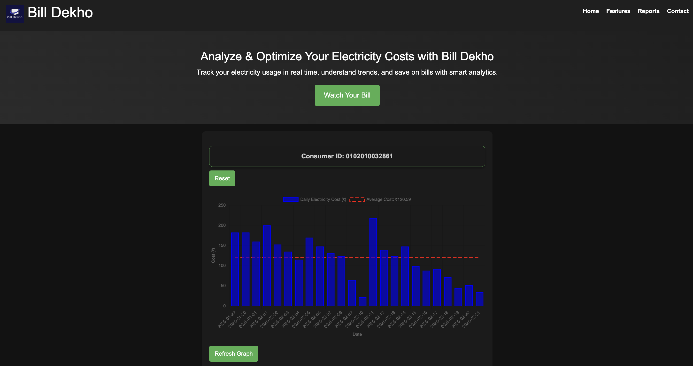

# Bill Dekho

## Overview

Welcome to **Bill Dekho**! This web application is designed to help users analyze and optimize their electricity costs through smart analytics. My aim is to provide an intuitive platform where users can track their electricity usage in real time, understand consumption trends, and ultimately save on their bills.

## Technology Stack

The following technologies have been used in the development of Bill Dekho:

- **Frontend:** 
  - HTML
  - CSS (Bootstrap for responsive design)
  - JavaScript (Chart.js for data visualization)

- **Backend:**
  - Django (Python) for handling requests and business logic
  - Docker for containerization
  - Nginx for serving the application and managing redirects

- **Database:**
  - SQLite (or your preferred database)

## Features

- **User-Friendly Interface:** A clean and easy-to-navigate interface for users to enter their consumer ID and view their electricity bill.
- **Real-Time Data Analysis:** Users can see their electricity consumption data represented in visually appealing charts.
- **Dynamic Redirection:** The application seamlessly redirects from the main domain to the application running on port 8000.

## Screenshot




## Installation and Setup

Follow these steps to set up the Bill Dekho application on your local machine or server:

### Prerequisites

- Ensure you have Docker installed on your machine. If you haven't installed it yet, you can do so using the following commands on Ubuntu:

  ```bash
  sudo apt update
  sudo apt install docker.io
  sudo usermod -aG docker $USER
  ```

  (Log out and log back in to apply the changes.)

### Building the Docker Image

1. Clone the repository to your local machine:

   ```bash
   git clone https://github.com/Pshar10/bill_dekho.git
   cd bill_dekho
   ```

2. Build the Docker image using the following command:

   ```bash
   docker buildx build --platform linux/amd64 -t pshar10/bill_dekho:v3 --output type=docker .
   ```

3. Push the Docker image to your Docker Hub repository:

   ```bash
   docker push pshar10/bill_dekho:v3
   ```

### Running the Application

1. Start the Docker container, mapping port 8000:

   ```bash
   docker run -d -p 8000:8000 --name bill_dekho pshar10/bill_dekho:v3
   ```

### Setting Up Nginx

1. Install Nginx on your server if you haven't done so already:

   ```bash
   sudo apt update
   sudo apt install nginx
   ```

2. Configure Nginx by editing the default configuration file:

   ```bash
   sudo nano /etc/nginx/sites-available/default
   ```

   Replace its contents with the following:

   ```nginx
   server {
       listen 80;
       server_name $host app.myself-pranav-sharma.online;  # Replace with your server's IP or domain name

       location / {
           return 301 http://$host:8000$request_uri;  # Redirect to port 8000
       }
   }
   ```

3. Test the Nginx configuration for any syntax errors:

   ```bash
   sudo nginx -t
   ```

4. Reload Nginx to apply the changes:

   ```bash
   sudo systemctl reload nginx
   ```

## Usage

Once everything is set up and running, you can access Bill Dekho by navigating to your server's IP address or domain in a web browser. Enter your consumer ID to view your electricity bill and analyze your consumption data.

## Contribution

If you would like to contribute to this project, feel free to fork the repository and submit a pull request. Any feedback or suggestions are also welcome!

## License

This project is licensed under the MIT License.

